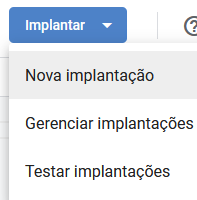
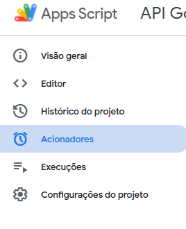

# Formulário com API

Um projeto simples para integrar um formulário HTML com uma API do Google Sheets, permitindo que os dados sejam salvos diretamente em uma planilha.

## Funcionalidades

- Envio de um formulário HTML para uma planilha Google Sheets.
- Validação dos campos do formulário antes do envio.
- Feedback visual para o usuário após o envio dos dados.

## Conteúdo

- [Código do projeto](#código-do-projeto)
- [Como usar o google sheets como API?](#como-usar-o-google-sheets-como-api)
- [Instalação](#instalação)
- [Contato](#contato)

## Código do projeto

### HTML
O formulário principal `index.html` contém:
- Campos para nome, e-mail, telefone e mensagem
- Validação básico com  HTML5
- Integração com JavaScript para envio dos dados

### CSS
o arquivo `style.css` inclui:
<!-- - Layout responsivo para diferente telas -->
- Efeitos visuais nos botões e campos
- Feedback visual para o usuário

### JavaScript
O `scriptt.js` é responsável por:
- Coletar dados do formulário
- Enviar para a API do Google Sheets
- Exibir mensagens de sucesso/erro

## Como usar o google sheets como API?

O código original que usei no script do google sheets foi do [Jamie Wilson](https://github.com/jamiewilson/form-to-google-sheets), fiz algumas alterações pesquisando e implementando verificações para não ocorrer erro no envio do conteúdo do formulário para a API. Acesse o script [aqui](./public/script%20google%20sheets/script.gs)

Depois de criar o script da API vamos criar uma implementação para que de fato funcione.

### Passo a passo

**1. Criar implantação**
- Vá em "Implantar" > "Nova implantação"



- Selecione o tipo "App da Web"
- Adicione uma descrição, caso necessário
- "Executar como" > "Eu"
- "Quem pode acessar" > "Qualquer pessoa"


Desta forma, qualquer pessoa que tenha acesso ao seu formulário irá conseguir enviar uma resposta e os dados irão ser guardados na sua planilha.


Copie esta URL e adicione no seu script.

**2. Criar Acionadores**

Selecione a seção de acionadores para configurar o seu próprio. Ele funciona assim: sempre que um usuário enviar o formulário, o acionador detectará o eventto de envio e executará automaticamente a função programada no script.



Ao entrar nesta aba selecione "Adicionar acionador"


- "Função" > "doPost"
- "Tipo de evento" > "Ao enviar formulário"

Opções além destas você não precisa alterar.

Clique em **salvar**


### BÔNUS: Editar implantações

Sempre que modificar o script, crie uma nova versão da implantação.

Vá em "Gerenciar Implantações".


Nesta parte você terá todas as implantações do seu projeto, selecione a implantação ativa e clique para editar, selecione uma nova versão e adicione uma descrição caso necessário, clique em "Implantar" para finalizar.


## Instalação

Clone o respositório:
```bash
git clone https://github.com/Felipe-Tamura/Formulario-com-API.git
```

## Contato

**Felipe Tamura** - [Linkedin](https://www.linkedin.com/in/felipe-tamura-b35373215/) - [GitHub](https://github.com/Felipe-Tamura) - [felipe.tamurang@gmail.com](mailto:felipe.tamurang@gmail.com?subject=Contato%20via%20Github)